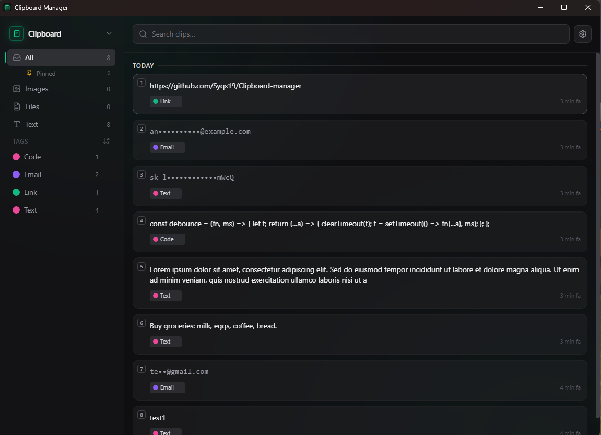
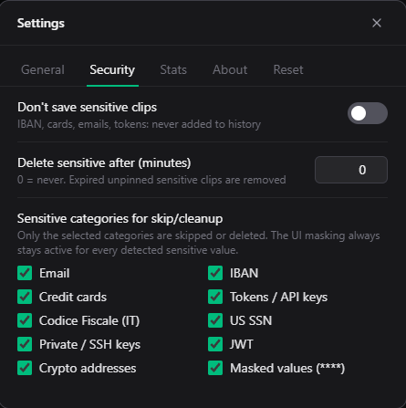
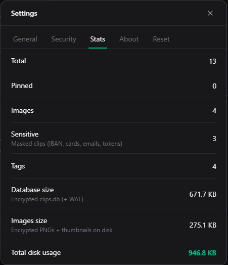
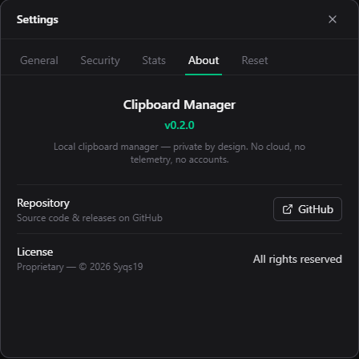

# Clipboard

A **clipboard history manager for Windows**: local, encrypted, no accounts, no cloud. It saves everything you copy (text, links, images, files, HTML/RTF), organizes it by category and tag, and lets you bring it back with a keyboard shortcut.

> **Privacy-first**: zero network, zero telemetry, zero external services. Everything stays on your PC, encrypted at rest with your Windows key.

---

## Screenshots

  

  
  &nbsp;
  
  &nbsp;
  

Main history · Security categories · Stats · About

---

## What it does

- **Automatic clipboard history**: text, URLs, images (PNG), files copied from Explorer (CF_HDROP), HTML and RTF.
- **Quick open** with `Ctrl+Shift+V` (configurable). Navigate with `↑↓`, copy with `Enter` or `1-9` for the top nine clips.
- **Sidebar categories**: All, Images, Files, Text. Each category exposes a "Pinned" sub-entry to filter only the pinned clips of that type.
- **Manual and automatic tags** with custom colors, shared picker, drag & drop reordering of pinned items.
- **Sensitive data detected and masked** automatically: emails, IBANs, credit cards, tokens, JWTs, private/SSH keys, crypto addresses, Italian Codice Fiscale and US SSN. Toggle "Never save" and a configurable TTL for automatic deletion.
- **Password-manager friendly**: respects the `ExcludeClipboardContentFromMonitorProcessing` and `CanIncludeInClipboardHistory` clipboard formats, so KeePass / 1Password / Bitwarden clipboards never land in history.
- **JSON Export / Import** to move history to another machine.
- **Tray icon** with menu (Open, Pause capture, Settings, Quit).

## Privacy & security

The SQLite history file (`%APPDATA%\com.clipboardmanager.app\clips.db`) is encrypted with **SQLCipher** (AES-256). Images on disk (`images/*.png`) are encrypted with **AES-256-GCM**.

The master key is generated on first launch and stored in `key.bin`, **encrypted via Windows DPAPI** (user scope): only your Windows account on the same machine can decrypt it. No password to remember.

Opening the files with DB Browser or a PNG viewer just shows random bytes. UI masking of sensitive contents is orthogonal to encryption — it protects against shoulder-surfing even when the data is decrypted.

**What it doesn't protect against**: malware running under your Windows account can call DPAPI just like you can. For that you'd need a manual passphrase (not yet implemented).

## Stack

- **Tauri 2.x** (Rust backend) + **React + TypeScript + Vite** + **Tailwind CSS v4**
- SQLite via **`rusqlite`** with the `bundled-sqlcipher-vendored-openssl` feature (engine + crypto compiled into the executable)
- Clipboard: **`clipboard-master`** (event-driven monitor) + **`arboard`** (read/write text/image)
- Drag & drop of pinned items: **`@dnd-kit`**
- Encryption: **`aes-gcm`** + **Windows DPAPI** (`CryptProtectData` / `CryptUnprotectData`)

## Install

Download the latest installer:

- **MSI** (recommended): [Clipboard.Manager_x64_en-US.msi](https://github.com/Syqs19/Clipboard-manager/releases/latest/download/Clipboard.Manager_0.1.0_x64_en-US.msi)
- **NSIS exe** (alternative): [Clipboard.Manager_x64-setup.exe](https://github.com/Syqs19/Clipboard-manager/releases/latest/download/Clipboard.Manager_0.1.0_x64-setup.exe)

Double-click to install. Code signing isn't set up yet, so Windows SmartScreen may show a warning — click "More info" → "Run anyway".

### Updates

The app checks for updates automatically on launch. When a new version is available, a green **"Update to vX.Y.Z"** button appears at the bottom of the sidebar. Clicking it downloads the signed bundle, verifies its signature against the embedded public key, installs it and relaunches the app.

## Development

### Prerequisites

- **Node.js** 20+ and npm
- **Rust** (https://rustup.rs/) with the MSVC toolchain
- **Visual Studio Build Tools 2022** with the "Desktop development with C++" workload
- **Strawberry Perl** (needed to build OpenSSL/SQLCipher): `winget install StrawberryPerl.StrawberryPerl`

### Commands

| Task | Command |
|------|---------|
| Dev (hot-reload) | `npm run tauri dev` |
| Build installer | `npm run tauri build` → `.msi` + `.exe` (NSIS) in `src-tauri/target/release/bundle/` |
| Frontend type-check | `npx tsc --noEmit` |
| Rust backend tests | `cargo test --manifest-path src-tauri/Cargo.toml` |
| Regenerate icons | `npm run tauri -- icon app-icon.png` |

### Architecture

The Rust backend is organized **by domain**, in modules rather than a few giant files.

Backend (`src-tauri/src/`):
- `lib.rs` — Tauri builder: opens DB, loads settings into a shared `Arc<RuntimeState>`, registers hotkey, builds tray, starts watcher and background sweeps, runs the `invoke_handler!` registry.
- `clipboard_watcher.rs` — background thread; captures text/URLs/images/files/HTML/RTF, dedup, prune, emits `clips-changed`.
- `categorizer.rs` — classifies text → `ContentType` + UI tag (Link/Email/Numbers/Code/…) + sensitive kind.
- `db/` — SQLCipher (WAL), split by domain (`mod.rs` for schema/migrations/types + shared helpers, then `clips.rs` / `tags.rs` / `groups.rs` / `tests.rs`). `clips`/`tags`/`clip_tags`/`clip_items` tables; dedup by FNV-1a hash. The `ContentType` enum lives here.
- `commands/` — Tauri commands, grouped by macro-section: `clipboard/{clips,tags,io}` and `system/{settings,shell,stats}`. Re-exported via `pub use` so `lib.rs` keeps using `commands::<name>`.
- `error.rs` — `AppError` (`thiserror`): every command returns `AppResult<T>`; serialized to a plain error string for the frontend.
- `crypto.rs` — master key (DPAPI) + AES-GCM for PNGs. `settings.rs` — `RuntimeState`. `images.rs` — encrypted PNG encode/decode + thumbnails. `ocr.rs` — Windows WinRT OCR (offline). `transforms.rs` — "Paste as" transforms. `win_clipboard.rs` — WinAPI for CF_HDROP/CF_HTML/CF_RTF + exclusion formats. `tray.rs` — tray icon + menu.

Frontend (`src/`):
- `App.tsx` — global state, keyboard navigation, drag & drop, watcher events, section router.
- `components/` — Sidebar, SearchBar, ClipList, ClipCard, GroupDetail, GroupPreview, ImagePreview, SelectionBar, Settings, TagPicker, TransformPicker, CodeBlock, Toaster, Onboarding, UpdateButton.
- `lib/` — `api.ts` (invoke + listen wrappers, plus the `ContentType` union and `Tag` interface mirroring the Rust types), `format.ts` (masking + tag colors), `useImageUrl.ts` (encrypted images via Blob), `useExitAnimation.ts` (exit animations).

Runtime data: `%APPDATA%\com.clipboardmanager.app\` → `clips.db` (encrypted), `key.bin` (DPAPI), `images/*.png` (encrypted), `settings.json`.

## Scope choices

- **Windows-only** (deliberate — not cross-platform).
- **Dark mode only** (by choice).
- `Enter` / `1-9` = **copy only**, no auto-paste: the window stays open and the user runs `Ctrl+V` wherever they want.

## Roadmap

See [IMPROVEMENTS.md](IMPROVEMENTS.md) for the detailed status. Pending highlights:

- Tools / Design sections (Port Killer, Pixel Perfect, project launcher)
- List virtualization for very large histories
- Code signing (removes SmartScreen — needs a paid certificate)

## License

Copyright © 2026 Syqs19. **All rights reserved.** Proprietary — no permission
is granted to use, copy, modify, or distribute this software or its source
code without prior written permission. See [LICENSE](LICENSE).
